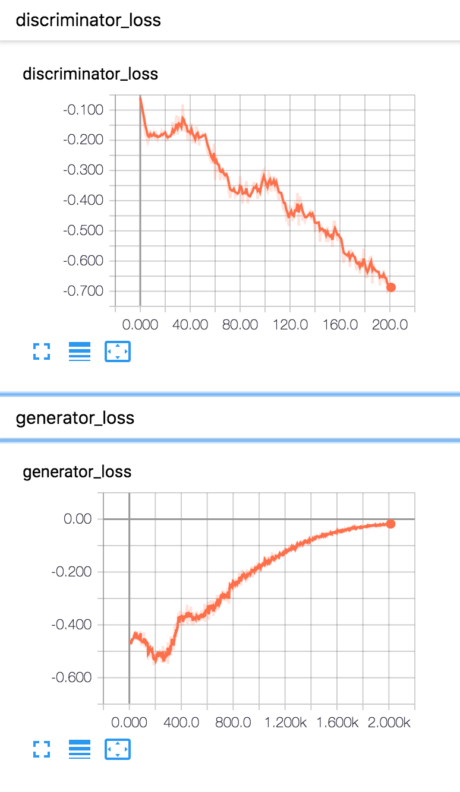

This code implements the "GAN Q-Learning" algorithm found in https://arxiv.org/abs/1805.04874. 

## TODO 

- [x] Example architectures 

- [ ] Example results

### Modifications From Paper

* The published algorithm has a typo in it (in the form of the discriminator loss)

* Currently, there seems to be a situation which causes the discriminator to (eventually) perfectly discriminate against the generator (even before learning the actual distribution) on the cartpole environment. I've experimented with different hyperparamters, but this is definitely there. For example, even when I update the generater 10 times per discriminator update, the training graph is still as follows

